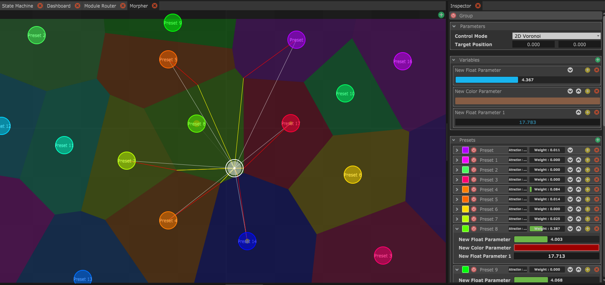

# The Morpher : 2D interpolations made fun

Le Morpher était à l'origine un projet parallèle, issu du besoin d'un interpolateur 2D qui interpolerait entre plusieurs presets. Il a finalement été fusionné dans le système Custom Variables de Chataigne, permettant de créer facilement des interactions entre cet interpolateur et le mécanisme de Chataigne, ainsi que de créer plusieurs interpolateurs séparés.

En sélectionnant **2D Voronoi** dans le paramètre "Control Mode" de votre Custom Variables Group, vous pouvez alors utiliser le conteneur et le panneau Morpher, pour placer en 2D tous vos presets.  
En utilisant un algorithme de proximité basé sur Voronoï, la cible blanche définit le poids de chaque préréglage en fonction de sa distance par rapport à la cible, mais aussi en fonction de la disposition globale du Morpher.

Après avoir mis en place votre mise en page, vous pouvez commencer à jouer avec l'attraction et le decay pour créer des comportements encore plus imprévisibles.
