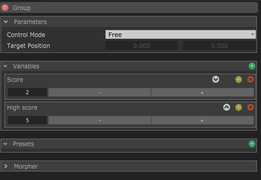
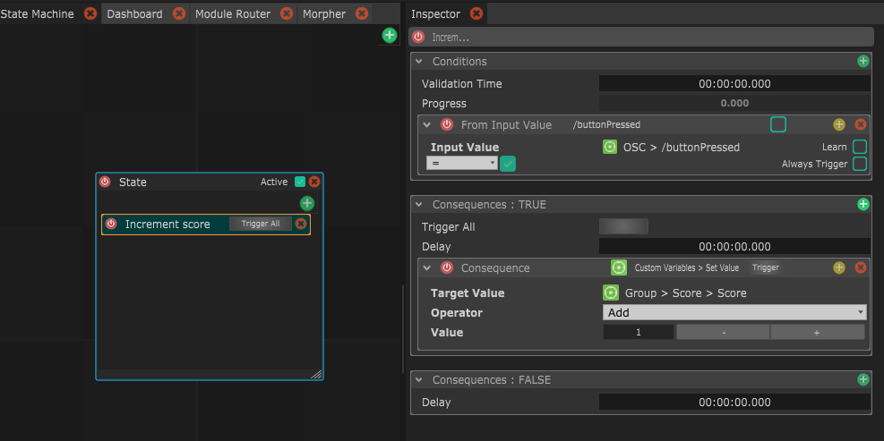
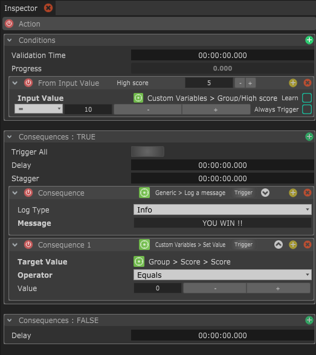

# Example 1 : Simple game logic

For instance, you could \(and people have done it !\) create a simple game logic with Custom Variables, storing the current score and the high score of the game.

Then you can have any event, like the press of a button, increment your current score

And finally add another action to verify if the current score is a certain number to check if the game is finished. In this same action you can then show an "end of game" message and also reset the current score to 0.

