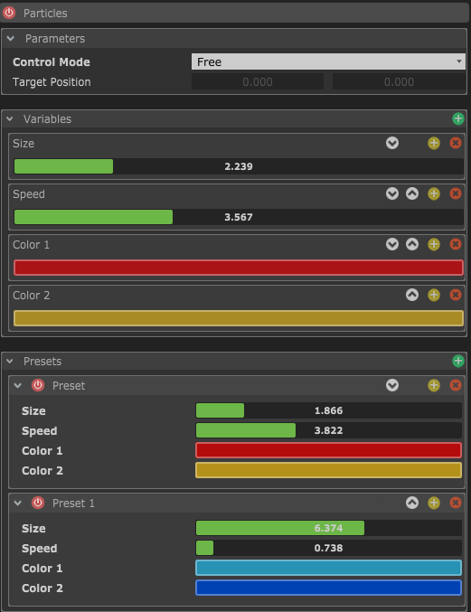
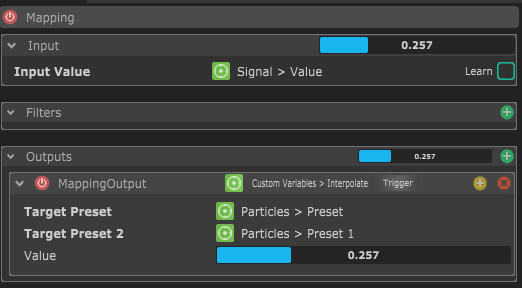
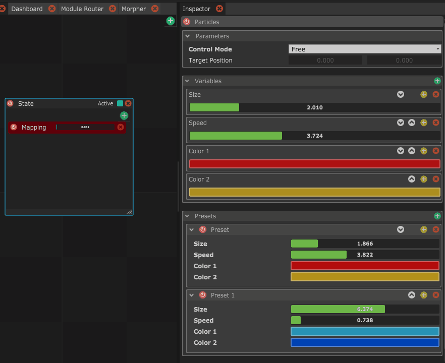

# Example 2 : Particle system presets

Another use of the Custom variables is to store different preset of values.

Let's say you have a particle system made in Unity or Processing, or a video of particles in Resolume or MadMapper. Your system is controlled by OSC, so you can send multiple OSC values to change it's style.

Custom Variables can help you create sets of parameters that you want to keep and send

Once you have different presets, you can start interpolating them with Special Module's commands

Here is the result in the Custom variables view

