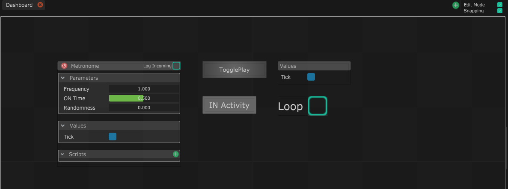

# Introduction to the Dashboard

Le tableau de bord est un moyen de créer une interface personnalisée en important, en plaçant et en stylisant tous les éléments de votre composition dans une vue. Vous pouvez créer autant de tableaux de bord que vous le souhaitez.


Bien que le tableau de bord soit déjà fonctionnel et utile, il est en cours de développement et est susceptible de subir des modifications de dernière minute.



Vous pouvez facilement passer du mode édition au mode lecture avec le raccourci Ctrl+E


