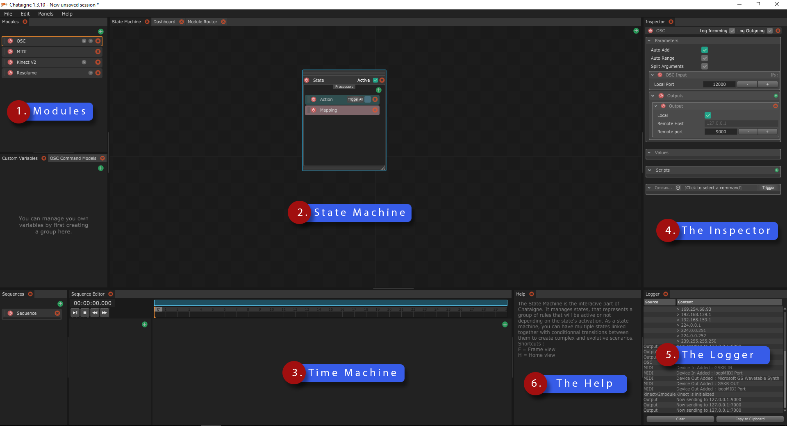

# L'Interface

The interface can be frightening at first, but worry not, it will quickly make sense as we dissect it together. Here it goes.

### Global notes

The interface is based on a sub-framework called "Organic UI", which features a ShapeShifter mechanism.

Basically, this means that you can change the panel layout as much as you want, and save different layouts depending on what you want to work on.

### 1. The Module Panel

This first panel is you starting point. This is where you can create the different modules, each one being a connection to another software or device. When creating a project, you will start by listing all the software and devices you want to interact with, and add them here. You can find more infos about the modules in the [Module Page](the-modules.md)

### 2. The State Machine

This panel will let you create your own interaction rules to do realtime control of all your system. As the name says, it's a state machine, which means you can create different states, each one being a group of rules that you can activate or deactivate as you wish. You can also create transitions between them, allowing for creating evolving interactions. You can find more infos in the [State Machine Page](../the-state-machine/introduction-to-the-state-machine.md)

### 2. The Time Machine \(or Sequence Editor\)

This panel will let you create timeline-based sequences and create triggers and parameter animations over time. You can find more infos in the [Time Machine Page](../the-time-machine-sequences/introduction-to-the-time-machine.md)

### 3. The Inspector

The Inspector is your main editing panel, you'll spend a lot of time there ! Anything you can select in the software will be showed in detail in this panel. You can then edit all the properties of this item.  
If you select another item, then the elements in this panel will change to show the newly selected item.

### 4. The Logger

The Logger is your verbose friend. It will tell you if something wend well or failed, as well as other useful informations such as your IP addresses when you create a network module. You can also log you own message and values there so you can keep track of what's happening when building complex setups.

### 5. The Help

The help is a good starter panel, showing you useful hotkeys and how to use the item you're hovering.

### 6. The Warnings

The Warnings panel is handy when loading a file and checking if there are anything that has been broken, files missing, scripts error, broken links, etc.

## Next

Interface, check. Now let's go and play with some Modules !

