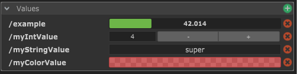
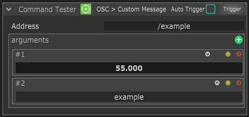
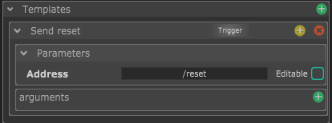

# Les Modules

Les modules représentent tous les autres logiciels et périphériques avec lesquels tu vas intéragir dans Chataigne.

Ils sont divisés en plusieurs catégories représentant les différents types d'interface. Chataigne propose à la fois des modules dédiés à certains logiciels et périphériques préconfigurés pour faciliter le contrôle de ceux-ci, mais également des modules génériques pour permettre de contrôler tout le reste.

## Anatomie d'un Module

### En-tête

A la sélection d'un module, tu peux trouver tout en haut dans l'Inspector un en-tête avec quelques controls. Tu peux par exemple activer / désactiver le module.  
Quand le module est désactivé, il ne se mettra pas à jour avec des nouvelles données, et n'enverra aucune donnée non plus.  
En fonction de la capacité du module à recevoir et / ou envoyer des données, tu peux choisir d'activer le log des données entrantes et / ou sortantes avec les boutons **Log Incoming / Log Outgoing**. Si ils sont activés, tu pourras vérifier dans le panneau Logger les données transitants dans ce module..

### Parameters

Cette section fournir tous les paramètres nécessaires à la configuration du module, comme les ports et IP de connection, ou alors le périphérique MIDI sur lequel se connecter, etc. Tu peux trouver plus d'infos sur les paramètres de chaque module dans leur page dédiée.

### Values

C'est une importante partie du module. Les Values sont les données que tu pourras utiliser pour créer des intéractions. Chaque module possède son propre set de values, d'autres comme le module OSC se remplissent au fur et à mesure de la réception de données, et d'autres non rien car ils ne peuvent pas recevoir.

### Scripts

Les scripts te permettront de créer des logiques plus complexes. Tu peux trouver plus d'infos dans la section [Scripts](../scripting/untitled.md).

### Command Tester

The command tester is a handy tool to be able to test the functionality of your module by sending commands manually. It is not affecting the rest of the software, and allows you to just verify that the communication between Chataigne and your software or device is functioning properly.


When testing commands, first set your parameters and then hit the "Trigger" buttons. If you want to send the command every time a parameter of this command has changed, you can check the **"Auto Trigger"** option.


### Templates

The templates are a good way to customize a module for a specific use without having to create your own custom module.  
You can create your own custom commands, by creating a new Template and choosing a base command to derive from. Then you can customize it, and choose which fields are editable, which are not, and setup default mapping behaviors.

