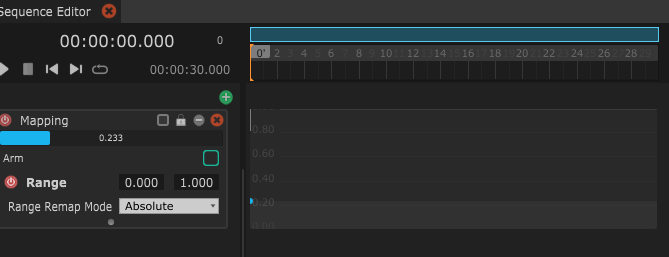
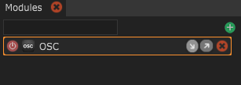

# La Cheat Sheet Ultime

## Common shortcuts

<table>
  <thead>
    <tr>
      <th style="text-align:left">Shortcut</th>
      <th style="text-align:left">Description</th>
    </tr>
  </thead>
  <tbody>
    <tr>
      <td style="text-align:left">(Ctrl or &#x2318;) + N</td>
      <td style="text-align:left">Cr&#xE9;e un nouveau fichier</td>
    </tr>
    <tr>
      <td style="text-align:left">(Ctrl or &#x2318;) + O</td>
      <td style="text-align:left">Ouvre un fichier</td>
    </tr>
    <tr>
      <td style="text-align:left">(Ctrl or &#x2318;) + Shift + O</td>
      <td style="text-align:left">Ouvre le dernier fichier ouvert</td>
    </tr>
    <tr>
      <td style="text-align:left">(Ctrl or &#x2318;) + S</td>
      <td style="text-align:left">Sauve le fichier courant</td>
    </tr>
    <tr>
      <td style="text-align:left">(Ctrl or &#x2318;) + Shift + S</td>
      <td style="text-align:left">Sauve le fichier en tant que nouveau (Sauver sous...)</td>
    </tr>
    <tr>
      <td style="text-align:left">(Ctrl or &#x2318;) + ;</td>
      <td style="text-align:left">Edite les Preferences (dans l&apos;Inspector)</td>
    </tr>
    <tr>
      <td style="text-align:left">(Ctrl or &#x2318;) + ,</td>
      <td style="text-align:left">Edite Project Settings (saved in the file)</td>
    </tr>
    <tr>
      <td style="text-align:left">(Ctrl or &#x2318;) + C</td>
      <td style="text-align:left">Copie la s&#xE9;lection courante</td>
    </tr>
    <tr>
      <td style="text-align:left">(Ctrl or &#x2318;) + V</td>
      <td style="text-align:left">Colle la s&#xE9;lection courante
         Ceci ne marche qu&apos;en collant des &#xE9;l&#xE9;ments de m&#xEA;me
        type</td>
    </tr>
    <tr>
      <td style="text-align:left">(Ctrl or &#x2318;) + X</td>
      <td style="text-align:left">Coupe la s&#xE9;lection courante</td>
    </tr>
    <tr>
      <td style="text-align:left">(Ctrl or &#x2318;) + D</td>
      <td style="text-align:left">Duplique la s&#xE9;lection courante</td>
    </tr>
    <tr>
      <td style="text-align:left">Alt + O</td>
      <td style="text-align:left">
        
Importe un fichier LiLNut et ajoute son contenu &#xE0; la session actuelle.

        
Le contenu peut &#xEA;tre de type Modules, States, Custom Variables,
           Module Router and Sequences

      </td>
    </tr>
    <tr>
      <td style="text-align:left">Alt + S</td>
      <td style="text-align:left">
        
Exporte un fichier LiLNut contenant la s&#xE9;lection courante.

        
Le contenu peut &#xEA;tre de type Modules, States, Custom Variables,
           Module Router and Sequences

      </td>
    </tr>
    <tr>
      <td style="text-align:left">(Ctrl or &#x2318;) + Selectionner</td>
      <td style="text-align:left">Inverse la s&#xE9;lection d&apos;un &#xE9;l&#xE9;ment</td>
    </tr>
    <tr>
      <td style="text-align:left">Shift + Selectionner</td>
      <td style="text-align:left">S&#xE9;lectionne tous les &#xE9;l&#xE9;mens jusqu&apos;&#xE0; celui-ci</td>
    </tr>
  </tbody>
</table>

## Inspector shortcuts

| Shortcut | Description |
| :--- | :--- |
| Shift + Click sur un en-tête de groupe | Inverse l'état ouvert/fermé des enfants de ce groupe |

| Shortcut | Description |
| :--- | :--- |
| _On a Slider or number label_ |  |
| Alt + Drag | Baisse la sensibilité du drag |
| Shift + Drag | Augmente la sensibilité du drag |

## State Machine shortcuts

<table>
  <thead>
    <tr>
      <th style="text-align:left">Shortcut</th>
      <th style="text-align:left">Description</th>
    </tr>
  </thead>
  <tbody>
    <tr>
      <td style="text-align:left">
        
Mouse middle
           button drag

        
or Alt + drag

      </td>
      <td style="text-align:left">Navigue dans la State Machine View</td>
    </tr>
    <tr>
      <td style="text-align:left">F</td>
      <td style="text-align:left">Recencre la vue sur le centre des States</td>
    </tr>
    <tr>
      <td style="text-align:left">H</td>
      <td style="text-align:left">Recentre la vue sur le centre absolute de la State View</td>
    </tr>
    <tr>
      <td style="text-align:left">Mouse wheel</td>
      <td style="text-align:left">Scroll vertical (sujet &#xE0; changements dans le futur)</td>
    </tr>
    <tr>
      <td style="text-align:left">Shift + Mouse wheel</td>
      <td style="text-align:left">Zoom avant /arri&#xE8;re</td>
    </tr>
    <tr>
      <td style="text-align:left">Shift + Enter in a comment</td>
      <td style="text-align:left">Ajoute une nouvelle ligne</td>
    </tr>
  </tbody>
</table>

## Time Machine shortcuts

### Timeline Manipulation

| Shortcut | Description |
| :--- | :--- |
| Bouger la barre bleu horizontal / vertical | Zoom et déplacement de la vue dans le temps |
| Click droit sur la barre bleue | Remet à zero la vue \(vue de la séquence en totalité\) |

| Shortcut | Description |
| :--- | :--- |
| Double clique sur les numéros | Crée une Time Cue |

### Mapping Layer \(and Mapping 2D\)

| Shortcut | Description |
| :--- | :--- |
| Double click dans le vide | Crée une nouvelle clé à cette position |
| Double click sur la courbe | Ajoute un point en maintenant la forme de la courve intacte |
| Shift + drag une clé | Bloque la valeur, ne bouge que la position dans le temps |
| Alt + drag une clé | Bloque la position, ne bouge que la valeur |
| \(Ctrl or ⌘\) + click sur la courbe | Change le Easing de la courbe |
| \(Ctrl or ⌘\) + shift + drag | Dessine la courbe manuellement  |

<table>
  <thead>
    <tr>
      <th style="text-align:left">Shortcut</th>
      <th style="text-align:left">Description</th>
    </tr>
  </thead>
  <tbody>
    <tr>
      <td style="text-align:left">Click-droit + drag sur la barre bleu</td>
      <td style="text-align:left">
        

        
Zoom s&#xE9;lectif de la timeline (absolu)

      </td>
    </tr>
    <tr>
      <td style="text-align:left">Click-droit + drag sur les num&#xE9;ros</td>
      <td style="text-align:left">Zoom s&#xE9;lectif de la timeline (relatif)</td>
    </tr>
    <tr>
      <td style="text-align:left">(Ctrl or &#x2318;) + click-gauche drag sur les num&#xE9;ros</td>
      <td style="text-align:left">Affiche le menu pour ajouter/supprimer du temps</td>
    </tr>
  </tbody>
</table>

### Module shortcuts

| Shortcut | Description |
| :--- | :--- |
| Drag du module dans un State | Affiche un menu pour automatiquement utiliser ce module dans une Action ou un Mapping |

| Shortcut | Description |
| :--- | :--- |
| Click sur les flèches d'activité | Active ou désactive le logging de données d'entrée / de sortie |

