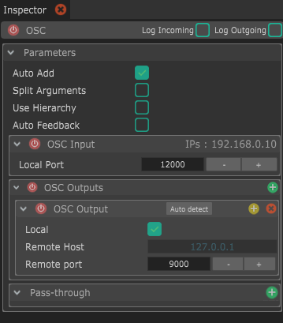
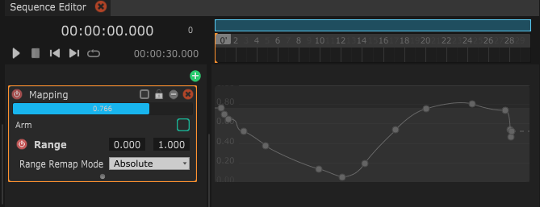
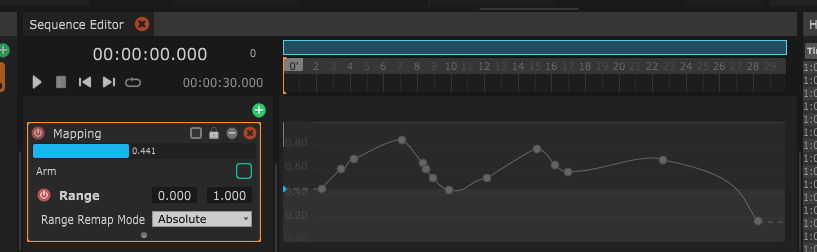
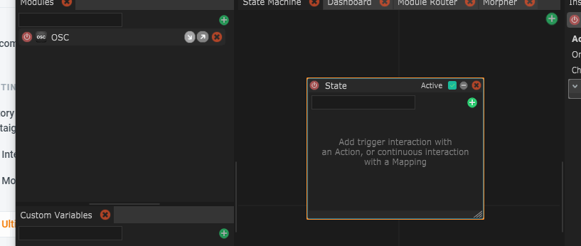
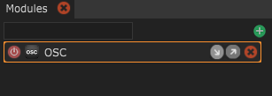

# La Cheat Sheet Ultime

## Common shortcuts

| Shortcut                   | Description                                                                                                                                                                        |
| -------------------------- | ---------------------------------------------------------------------------------------------------------------------------------------------------------------------------------- |
| (Ctrl or ⌘) + N            | Crée un nouveau fichier                                                                                                                                                            |
| (Ctrl or ⌘) + O            | Ouvre un fichier                                                                                                                                                                   |
| (Ctrl or ⌘) + Shift + O    | Ouvre le dernier fichier ouvert                                                                                                                                                    |
| (Ctrl or ⌘) + S            | Sauve le fichier courant                                                                                                                                                           |
| (Ctrl or ⌘) + Shift + S    | Sauve le fichier en tant que nouveau (Sauver sous...)                                                                                                                              |
| (Ctrl or ⌘) + ;            | Edite les Preferences (dans l'Inspector)                                                                                                                                           |
| (Ctrl or ⌘) + ,            | Edite Project Settings (saved in the file)                                                                                                                                         |
| (Ctrl or ⌘) + C            | Copie la sélection courante                                                                                                                                                        |
| (Ctrl or ⌘) + V            | 
Colle la sélection courante Ceci ne marche qu'en collant des éléments de même type
                                                                                       |
| (Ctrl or ⌘) + X            | Coupe la sélection courante                                                                                                                                                        |
| (Ctrl or ⌘) + D            | Duplique la sélection courante                                                                                                                                                     |
| Alt + O                    | 
Importe un fichier LiLNut et ajoute son contenu à la session actuelle.

Le contenu peut être de type Modules, States, Custom Variables, Module Router and Sequences
 |
| Alt + S                    | 
Exporte un fichier LiLNut contenant la sélection courante.

Le contenu peut être de type Modules, States, Custom Variables, Module Router and Sequences
             |
| (Ctrl or ⌘) + Selectionner | Inverse la sélection d'un élément                                                                                                                                                  |
| Shift + Selectionner       | Sélectionne tous les élémens jusqu'à celui-ci                                                                                                                                      |

## Inspector shortcuts

| Shortcut                               | Description                                          |
| -------------------------------------- | ---------------------------------------------------- |
| Shift + Click sur un en-tête de groupe | Inverse l'état ouvert/fermé des enfants de ce groupe |

| Shortcut                      | Description                     |
| ----------------------------- | ------------------------------- |
| _On a Slider or number label_ |                                 |
| Alt + Drag                    | Baisse la sensibilité du drag   |
| Shift + Drag                  | Augmente la sensibilité du drag |

## State Machine shortcuts

| Shortcut                                               | Description                                             |
| ------------------------------------------------------ | ------------------------------------------------------- |
| 
Mouse middle button drag

or Alt + drag
 | Navigue dans la State Machine View                      |
| F                                                      | Recencre la vue sur le centre des States                |
| H                                                      | Recentre la vue sur le centre absolute de la State View |
| Mouse wheel                                            | Scroll vertical (sujet à changements dans le futur)     |
| Shift + Mouse wheel                                    | Zoom avant /arrière                                     |
| Shift + Enter in a comment                             | Ajoute une nouvelle ligne                               |

## Time Machine shortcuts

### Timeline Manipulation

| Shortcut                                             | Description                                                 |
| ---------------------------------------------------- | ----------------------------------------------------------- |
| 
Bouger la barre bleu horizontal / vertical
 | Zoom et déplacement de la vue dans le temps                 |
| Click droit sur la barre bleue                       | Remet à zero la vue (vue de la séquence en totalité)        |
| Shift + déplacer le temps                            | Magnétise le déplacement aux autres éléments de la séquence |

| Shortcut                      | Description                                                           |
| ----------------------------- | --------------------------------------------------------------------- |
| Double clique sur les numéros | Crée une Time Cue                                                     |
| Shift + déplacer la Cue       | Magnétise le déplacement de la cue aux autres éléments de la séquence |

### Mapping Layer (and Mapping 2D)

| Shortcut                          | Description                                                                                      |
| --------------------------------- | ------------------------------------------------------------------------------------------------ |
| Double click dans le vide         | Crée une nouvelle clé à cette position                                                           |
| Double click sur la courbe        | Ajoute un point en maintenant la forme de la courve intacte                                      |
| Shift + déplacer une clé          | Bloque la valeur, ne bouge que la position dans le temps                                         |
| Alt + déplacer une clé            | Bloque la position, ne bouge que la valeur                                                       |
| Shift + Alt + déplacer une clé    | Bloque la vlauer, ne bouge que la position en magnétisant sur les autres éléments de la séquence |
| (Ctrl or ⌘) + click sur la courbe | Change le Easing de la courbe                                                                    |
| (Ctrl or ⌘) + shift + drag        | Dessine la courbe manuellement                                                                   |

| Shortcut                                         | Description                                         |
| ------------------------------------------------ | --------------------------------------------------- |
| Click-droit + drag sur la barre bleu             | 

Zoom sélectif de la timeline (absolu)
 |
| Click-droit + drag sur les numéros               | Zoom sélectif de la timeline (relatif)              |
| (Ctrl or ⌘) + click-gauche drag  sur les numéros | Affiche le menu pour ajouter/supprimer du temps     |

### Module shortcuts

| Shortcut                     | Description                                                                           |
| ---------------------------- | ------------------------------------------------------------------------------------- |
| Drag du module dans un State | Affiche un menu pour automatiquement utiliser ce module dans une Action ou un Mapping |

| Shortcut                         | Description                                                    |
| -------------------------------- | -------------------------------------------------------------- |
| Click sur les flèches d'activité | Active ou désactive le logging de données d'entrée / de sortie |

