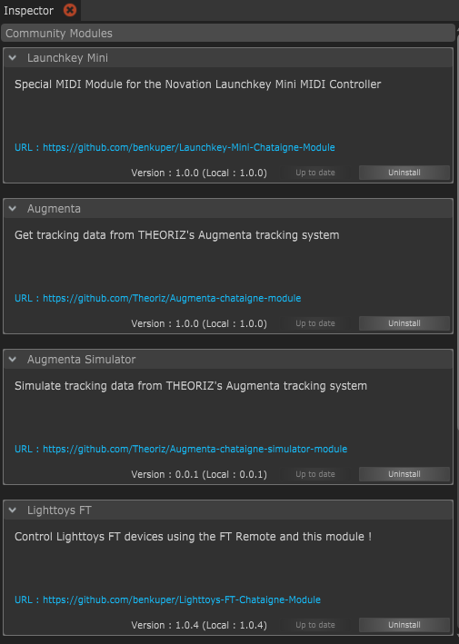

# Community Modules

Community modules are custom modules made by the community. They're based on existing modules, like OSC, MIDI or Serial, but are already prepared for a specific use, such as connecting to a particular MIDI device or Arduino board, or sending specific commands to a software that is not natively supported by Chataigne.

You can find those modules under the "Get more modules..." menu when creating a new Module in the Module panel.

If you want to make your own module, you can go the the next page [Making your own module](../making-your-own-module.md)

