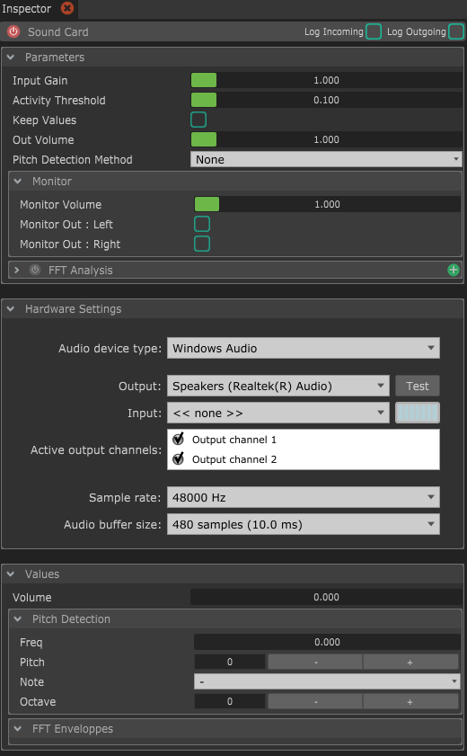
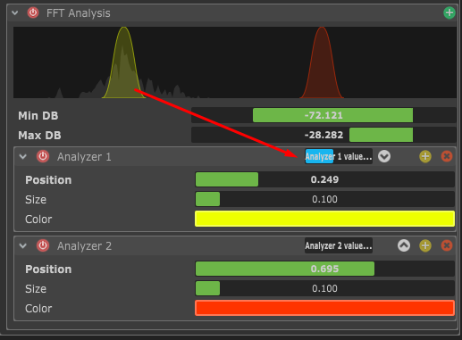

# Sound Card

Le module Sound Card te permettra de lire des sons et d'analyser un signal sonore. Il implémente une détection de pitch basique, ainsi qu'une analyses FFT pour créer des detection de volume basées sur la fréquence.


Si tu utilises un Audio Layer dans une Séquence, tu auras besoin d'un module Sound Card.



Tu peux connecter plusieurs cartes son différentes en créant plusieurs modules.



Afin d'optimiser la performance de Chataigne, les entrées audio, détection de pitch et analyse FFT sont désactivées par défaut. Si tu veux utiliser ces fonctionnalités, il faudra d'abord les activer. Mate donc la suite pour avoir plus d'infos.


## Parameters

* **Input Gain :** C'est le gain appliqué à l'entrée son. Ca affectera le volume détecté et le seuil de détéction d'activité. _Ce paramètre n'est utile que si une entrée est sélectionnée et que les channels ont été activés._&#x20;
* **Activity Threshold :** C'est le seuil de volume à partir duquel les systèmes d'analyse vont se déclencher. Si le volume (multiplié par le gain) est en dessous de ce seuil, le module considère qu'il n'y a aucune activité et ne va pas traiter le signal.
* **Keep values :** Par défaut, les valeurs de pitch, note, fréquence détectées sont mises à 0 quand aucune activité n'est détectée. Activer ce paramètre permet de garder les derniers résultats de l'analyse sans remettre à 0 quand il n'y a plus de signal entrant.
* **Out volume :** C'est le volume "master", qui affectera la totalité des générateur de son de Chataigne. Il est utilisé à la toute fin de la chaîne de traitement du son. Mettre ce paramètre à 0 aura pour effet de n'avoir aucun son sortant.
* **Pitch Detection Method :** Si il n'est pas sur None, cela va activer la détection de pitch quand le volume est au-dessus de _Activity Threshold._
  * **None :** Cette option désactive la détection du pitch. A garder sélectionné si on a pas besoin de détection pour optimiser les performances.
  * **MPM :** C'est une méthode détection de pitch simple mais efficace, surtout pour le chant et les instruments monophoniques. Si tu veux un peu de lecture, [c'est par ici.](http://miracle.otago.ac.nz/tartini/papers/A\_Smarter\_Way\_to\_Find\_Pitch.pdf)
  * **YIN :** C'est une méthode de détection de pitch un peu plus complexe que MPM, mais plus adaptée aux son polyphoniques, détections d'accord, etc. Plus d'infos [ici](https://www.eecs.qmul.ac.uk/\~simond/pub/2014/MauchDixon-PYIN-ICASSP2014.pdf).&#x20;
* **Monitor :** Le monitor permet de créer un pont direct entre les entrées et la sortie, sans traitement au milieu. Tu peux changer le gain du monitor et filtrer  quels channels renvoyer vers la sortie.
* **FFT Analysis :** Cette section te permettra d'effectuer de la détection basée sur la fréquence. Pour l'utiliser, tu dois d'abord l'activer en cliquand sur le bouton rouge en haut à gauche du panneau "FFT Analysis". Tu peux ensuite créer autant d'Analyzers que tu veux en cliquant sur le bouton "+" en haut à droite. Chaque FFT Analyzer va créer une value "Enveloppe" que tu peux retrouver dans le groupe "FFT Enveloppes" des Values du module.

* **FFT Parameters :**
  * **Min DB / Max DB :** Ce sont les fréquences minimum et maximum à laquelle faire le traitement. Réduire l'intervalle entre ces 2 paramètres peut être un moyen facile de filtrer le bruit du signal.
  * **Analyzer Position :** C'est la fréquence central à laquelle faire l'analyse.
  * **Analyzer Size :** C'est la "tolérance" autour de la fréquence centrale. Une valeur haute veut dire une détection plus tolérante, mais mois sensible.
  * **Color :**  La couleur de l'analyzer dans la vue fréquencielle.


Une fois que tu as fini de paramétrer l'analyse FFT, tu peux refermer le panneau FFT pour éviter de déssiner la courbe FFT et inasi optimiser l'usage CPU.


* **Hardware Settings :** C'est la que tu choisis la carte son sur laquelle te connecter, et quels channels activer.
