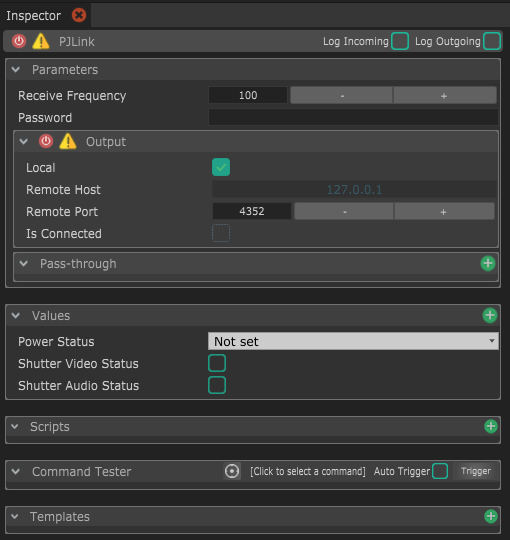

# PJLink

PJLink est une surcouche du protocole TCP, utilisé pour communiquer avec des vidéo projecteurs. Plus d'infos [ici](https://pjlink.jbmia.or.jp/english/).

## Parameters

Comme c'est un version légèrement modifiée du module TCP Client, tu peux checker la documentation de la page [TCP Client](tcp-client.md) pour comprendre les paramètres de ce module.

**Password :** Tu peux spécifier ici le mot de passe qui a été configuré \(ou pas\) dans les paramètres PJLink du vidéo projecteur.

Le Remote Port est mis par défaut à 4352, qui est le port par défaut pour le PJLink. Tu peux le changer si ce n'est pas le port qui est configuré dans le vidéo projecteur.

Des values sont déjà précrées pour pouvoir facilement récupérer des informations de l'état du vidéo projecteur..


Ce module ne supporte pas le totalité de la spécification PJLink, les implémentation futures dépendront de la demande de la communauté et du temps disponible pour faire ça \(fais donc un [don](https://github.com/sponsors/benkuper) !\)


