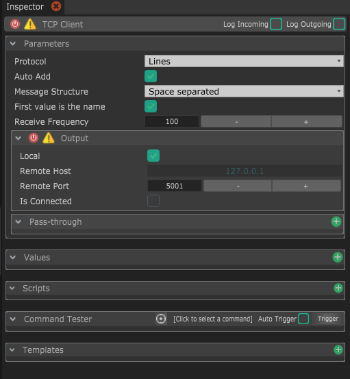

# TCP Client

This module allows to communicate with a TCP server

## Parameters

* **Protocol :** This is a way to easily parse incoming messages depending on the protocol you chose.
  * **Lines :** This will consider new data every time a new line character is received. Most Arduino users use new lines as messages split, so it's the default. 
  * **Raw :** If you want to get every byte separately, you can choose _Raw_, which won't do any parsing of incoming data.
  * **Data255 :** This will consider new data every time a byte with value of 255 is received. This is a personal and very efficient protocol if you don't care about loosing one byte precision, and only want to send single bytes as it obviously doesn't work for sending float or 32-bit integers.
  * **COBS :** This is parsing the data accordingly to the COBS mechanism. If you don't know what that is, check out the [Wikipedia page](https://en.wikipedia.org/wiki/Consistent_Overhead_Byte_Stuffing). 
* **Auto Add :** This will automatically add values when data is received. Keep it checked if you want to always convert the received data to values, otherwise if you want to only receive some data, uncheck it when you don't wan't to automatically add more values anymore 
* **Message structure :** This decides how every message should be parsed. It depends on the protocol you chose.
* **First value is the name :** If checked, messages will be expected in the format of 2 arguments : the first one is the name and the second one is the actual value.
* **Output :** This contains the parameters to connect to the server. When connected, a random port is automatically created to receive data as well.
  * **Local :** if checked, this will force this output to send to the same computer. It's handy to quickly switch between a remote computer and this computer, to test.
  * **Remote host :** This is the IP address of the computer to send data to. You need to uncheck _Local_ if you want to specify another address.
  * **Remote port :** This is the port to send the data to.
  * **Is connected :** Whether the device is connected or not to the remote. _Unlike UDP, this icon should reflect the actual state of the connection meaning that if it's checked, sent data should be received somewhere._ 
* **Pass-through :** This section allows you to directly transfer the incoming data  to other Streaming modules, i.e. [Serial](serial.md), [UDP](udp.md), [TCP Client](tcp-client.md) and [TCP Server](tcp-server.md). This allow for fast, optimized data transfer through modules, even for data that are not handled by Chataigne.


If you want to test receiving and sending TCP packets, I recommend [**PacketSender**](https://packetsender.com/)**,** which is a great free and cross-platform packet testing utility !


