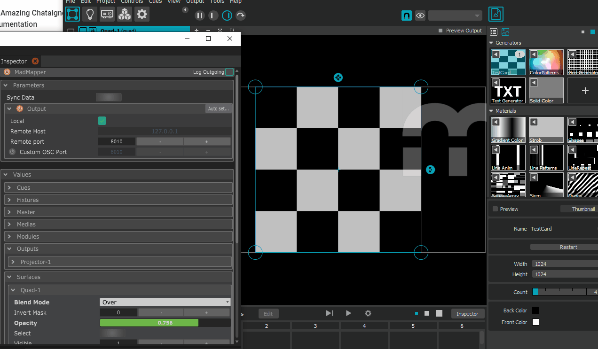

# MadMapper

MadMapper is a popular video mapping software made by [garageCube](https://www.garagecube.com/). You can find more about it [here](https://madmapper.com/).

The MadMapper module is based on the OSCQuery module, meaning that you first have to connect to the OSCQuery port \(default is 8010\).   
When connected, the module will synchronize all the parameter hierarchy from MadMapper and you will be able to control any parameter directly from the values.  
You can also use the **Set value** command, which will actually have  the same effect.

