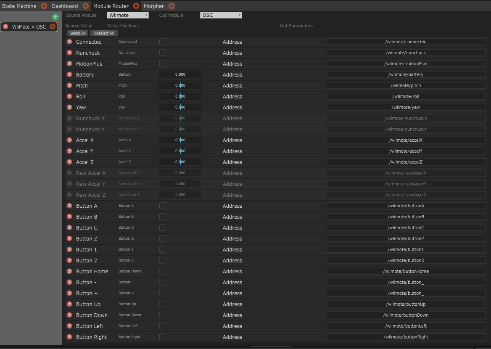

# The Module Router

The Module Router is a handy tool when you have a lot of mappings to do from one module to another.  
It allows to quickly select input values from one module and choose and have basic settings for outputting those values, depending on the  out module type.   
One router links one input to one output only, but you can create as many routers as you want.


If you want to transfer directly data from a module to another module _of the same type_, please consider using Module's **pass-trough** feature. It's optimised to do that and is way simpler to use.


