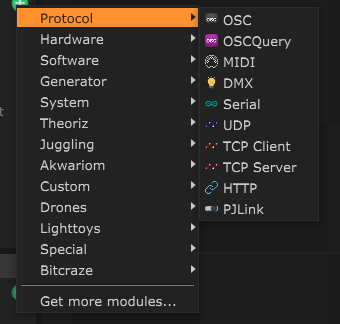

# Protocol

The Protocol category contains all the general purpose modules, so you can configure yourself all the control you need and not be limited to the existing supported softwares and devices.

