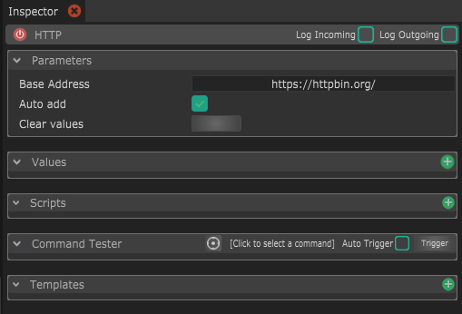

# HTTP

This module allows bi-directionnal communication with webpages and webservices, sending to and retrieve data from websites and APIs.

* **Base Address :** If you consider an HTTP module being one webservice end-point, there are high chances that most of your requests will have the same base URL. If that's the case, you can specify it here, so if the services is relocated, you just have to change this field without having to change the URL of  every command you created. 
* **Auto-add :** If this is checked, when receiving structured _JSON_ data, this will automatically create corresponding values with the same hierarchy as in the JSON. 
* **Clear Values :** This will conveniently remove all the parameters inside the _Values_ container.

