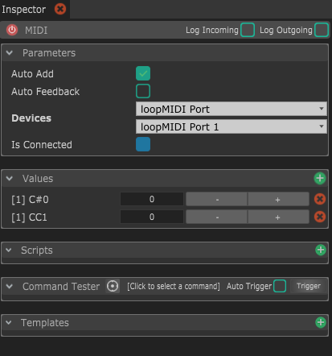

# MIDI

Le module MIDI permet de recevoir et envoyer des données MIDI à des périphériques MIDI physiques ou virtuels.

## Parameters

* **Auto-Add :** Cette option va automatiquement ajouter des values à la réception de données MIDI. Garde cette option activée dans que tu veux ajouter des nouvelles values, et désactive-la quand tu veux arrêter la création automatique de values.
* **Auto Feedback :** Une fois activée, les values modifiées seront automatiquement envoyées à la sortie MIDI. 
* **Devices :** Ce paramètre gère les périphériques sur lesquels se connecter. La première ligne est le MIDI Input, et la seconde est l'Output. _Tu n'as pas besoin que les deux soient connectés, tu peux n'utiliser que l'entrée ou que la sortie en fonction de tes besoins._
* **Is connected :** Affiche si le périphérique est bien connecté. Si au moins un des deux périphérique, entrée ou sortie est connecté, il sera activé.


Si tu veux envoyer des données MIDI à un autre logiciel sur le même ordinateur \(comme Ableton Live\) tu auras besoin d'un **MIDI Loopback,** qui te permettra de créer des périphériques MIDI virtuels sur ton ordinateur, que tu peux utiliser en Output sur Chataigne et en Input sur ton autre logiciel.

* Sur MacOS, tu peux utiliser le "Gestionnaire de Bus IAC"
* Sur Windows, je recommande personnellement [**loopMIDI**](https://www.tobias-erichsen.de/software/loopmidi.html), qui est gratuit, simple, stable et permet de créer autant de périphériques virtuels que tu veux.

Tu peux même envoyer des donénes MIDI sur un autre ordinateur à travers le réseau en utilisant un périphérique **RTP MIDI.**

* Sur MacOS, tu peux activée "Réseau MIDI" dans le panneau "Studio MIDI"
* Sur Windows, tu peux utiliser [**rtpMIDI**](http://www.tobias-erichsen.de/software/rtpmidi.html), qui a le même fonctionnement que le "Réseau MIDI" de Mac.


