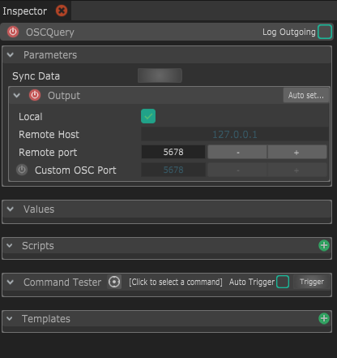

# OSCQuery

Control any OSCQuery-compatible application, retrieve all the parameters from this application and sync their values with Chataigne.

* **Sync Data :** When connected to an OSCQuery app, this will resync the data. There is currently not support for live syncing, so it needs to be manual. 
* **Output :** This is where you setup the OSCQuery parameters.
  * **Local :** if checked, this will force this output to send to the same computer. It's handy to quickly switch between a remote computer and the computer, to test.
  * **Remote host :** This is the IP address of the computer to connect to. You need to uncheck _Local_ if you want to specify another address.
  * **Remote port :** This is the port to connect to the _**OSCQuery webservice.**_
  * **Custom OSC Port :** This is the port to send OSC messages to. This is usually the same as the remote port, but in some cases like VDMX, you don't have the choice of choosing the OSC port and must specify another port for sending the actual OSC messages.
  * **Auto-set :** This is a handy tool to auto discover through Bonjour/Zeroconf  apps that support OSCQuery. This may not work on every computer, especially if you don't have the Bonjour services installed.

