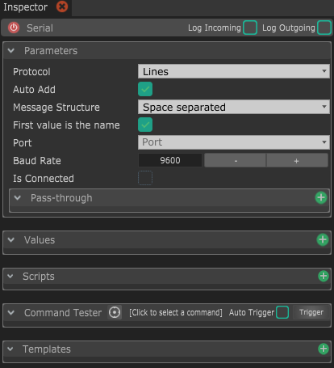

# Serial

Connect any serial device like Arduino and communicate with it

* **Protocol :** This is a way to easily parse incoming messages depending on the protocol you chose.
  * **Lines :** This will consider new data every time a new line character is received. Most Arduino users use new lines as messages split, so it's the default. 
  * **Raw :** If you want to get every byte separately, you can choose _Raw_, which won't do any parsing of incoming data.
  * **Data255 :** This will consider new data everytime a byte with value of 255 is received. This is a personal and very efficient protocol if you don't care about loosing one byte precision, and only want to send single bytes as it obiously doesn't work for sending float or 32-bit integers.
  * **COBS :** This is parsing the data accordingly to the COBS mechanism. If you don't know what that is, check out the [Wikipedia page](https://en.wikipedia.org/wiki/Consistent_Overhead_Byte_Stuffing). ****
* **Auto Add :** This will automatically add values when OSC messages are received. Keep it checked if you want to receive every OSC message and convert it to value, otherwise if you want to only receive some messages, uncheck it when you don't wan't to automatically add more values anymore ****
* **Message structure :** This decides how every message should be parsed. It depends on the protocol you chose. ****
* **First value is the name :** If checked, messages will be expected in the format of 2 arguments : the first one is the name and the second one is the actual value. ****
* **Port :** The serial port to connect to. ****
* **Baud rate :** The speed of the device to connect to. This is set inside the device. In Arduino code this is the parameter passed in the _**Serial.begin\(&lt;baudrate&gt;\)**;_ function. ****
* **Is connected :** Whether the device is connected or not. 
* **Pass-through :** This section allows you to directly transfer the incoming OSC messages to other OSC modules. This allow for fast, optimized data transfer through modules, even for messages that are not handled by Chataigne.

