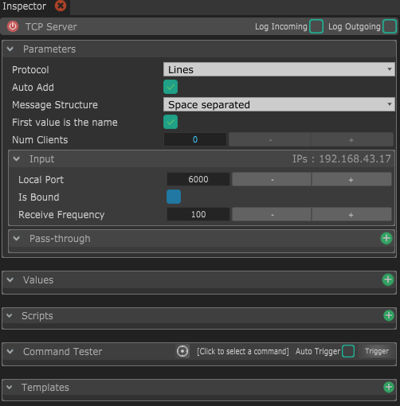

# TCP Server

This module allows to create a server on which any number of TCP clients can connect to.

## Parameters

* **Protocol :** This is a way to easily parse incoming messages depending on the protocol you chose.
  * **Lines :** This will consider new data every time a new line character is received. Most Arduino users use new lines as messages split, so it's the default. 
  * **Raw :** If you want to get every byte separately, you can choose _Raw_, which won't do any parsing of incoming data.
  * **Data255 :** This will consider new data every time a byte with value of 255 is received. This is a personal and very efficient protocol if you don't care about loosing one byte precision, and only want to send single bytes as it obviously doesn't work for sending float or 32-bit integers.
  * **COBS :** This is parsing the data accordingly to the COBS mechanism. If you don't know what that is, check out the [Wikipedia page](https://en.wikipedia.org/wiki/Consistent_Overhead_Byte_Stuffing). _\*\*_
* **Auto Add :** This will automatically add values when data is received. Keep it checked if you want to always convert the received data to values, otherwise if you want to only receive some data, uncheck it when you don't wan't to automatically add more values anymore
* **Message structure :** This decides how every message should be parsed. It depends on the protocol you chose. _\*\*_
* **First value is the name :** If checked, messages will be expected in the format of 2 arguments : the first one is the name and the second one is the actual value. 
* **Input :** \__\*\*_\_Input allows you to receive data. It's good practice to disable it if your module is supposed to only send data and not receiving any. You will see in the Module list that the "Incoming data" icon is automatically hidden when disabling the  Input.
  * **Local Port :** This is the port on which your external software will send the data.
  * **Is Bound :** This shows if the port was successfully bound and the module is able to receive data.
  * **Receive Frequency :** The rate at which to receive the data. Lower frequency will optimize CPU usage and overall performance, but if you receive too much data, you may loose some or not receive it in time, as multiple packets will be processed at the same time. _\*\*_
* **Pass-through :** This section allows you to directly transfer the incoming data  to other Streaming modules, i.e. [Serial](serial.md), [UDP](udp.md), [TCP Client](tcp-client.md) and [TCP Server](tcp-server.md). This allow for fast, optimized data transfer through modules, even for data that are not handled by Chataigne.


If you want to test receiving and sending TCP packets, I recommend [**PacketSender**](https://packetsender.com/)**,** which is a great free and cross-platform packet testing utility !


