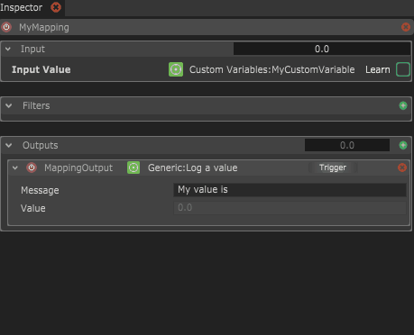
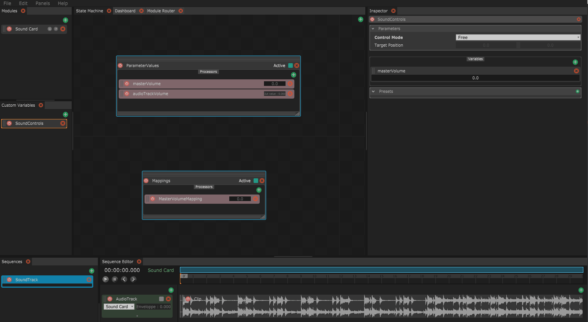
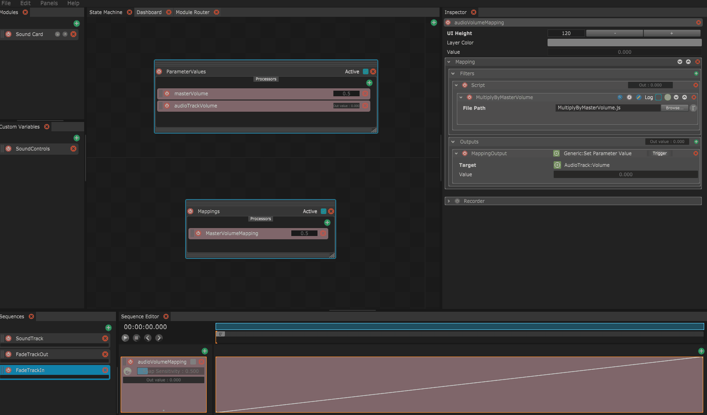

# Filter Scripts

Filter scripts are JavaScript files that can be used as a filter in a mapping. They are created as separate JavaScript files and can be added in the filter tab by choosing the script option.



Filter scripts are useful to add math functions or advanced filtering logic to your mappings.

## Filter script example : Audio track fading to master volume.

In this example, we consider a simple project with a looping audio track. We also have a masterVolume custom variable controlling the audio track volume through a mapping.



Now we would like to add the ability to fade in and out our audio track. We can do this using sequences which directly control the volume of the audio track. However, in order to respect the current value of the masterVolume, these sequences output need to be remapped from \[0; 1\] to \[0; masterVolume\].

This can be done with a simple filter script multiplying the output value of the fade sequences mappings by the masterVolume value. We create the following MultiplyByMasterVolume.js script :

```javascript
function filter(value)
{
    return value*root.customVariables.soundControls.variables.masterVolume.masterVolume.get();
}
```

This filter script returns the input value **value**, multiplied by the custom variable masterVolume.

Reminder : You can quickly get the Script address of any variable in Chataigne by right-clicking on it and selecting **Copy Script Control Address**, then you can use the function get\(\) to get the current value of this variable in a script.

We just have to assign this script as a filter script in our fade sequences mappings to get what we want : fading sequences that fade between 0 and the current masterVolume value.



