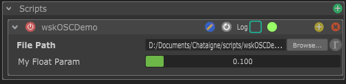

# Introduction to Scripts

## Scripting In Chataigne

While Chataigne tries to enable many things as possible without coding, some mechanism and behaviors are just too complex to benefit from a visual-only system. When the case occurs, scripts are there to fill this hole. They have been integrated in Chataigne in such a way that their footprint is very small and it feels seamless.

Scripts can be found and created in different places of Chataigne, depending on the role of them :

* in [Modules ](../getting-started-1/the-modules.md): see the [Module Scripts](module-scripts.md) section. 
* in [Conditions ](../the-state-machine/actions.md#conditions): see the [Condition Scripts](condition-scripts.md) section. 
* in [Filters ](../the-state-machine/mappings.md#filters): see the [Filter Scripts](filter-scripts.md) section.

### Creating a Script

When creating a script, the script container will be empty. You can then choose to either load an already existing file by clicking "Browse...", or create a new file by clicking on the blue icon with a pencil inside \(I know it's very small and not recognizable\). This will create the file and open it in your default editor.


Most systems don't have a default editor for Javascript file. I strongly recommend using [**Sublime Text**](https://www.sublimetext.com/) or [**VS Code**](https://code.visualstudio.com/) ****as your default Javascript editor !


When creating a new script, the newly created file will already be filled with content that aims to guide new users. This content is dynamically generated depending on the object you created your script from. For instance, if you create it in an OSC module, you will have generic content, but also module-specific content as well as OSC-specific content.

Scripts are compiled and interpreted in real-time, meaning that every time you save your script file, it will be automatically reloaded in Chataigne. At any time, you can check the [Logger](../getting-started-1/the-interface.md#4-the-logger) panel to see the compilation result :

* If the script is well written and compiles, the Logger will tell that it loaded successfully and you will see in the script's Inspector a green dot like in the picture above. 
* If the script is badly written or has compile errors, the Logger will tell that it has error and will show the error and the line of the error, which is very fast and convenient to fix bugs. When a script has loading problems, a warning will be shown as well, and a red dot is visible on the script's inspector.

