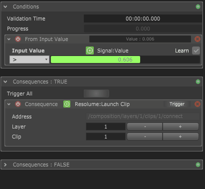

# Actions

Actions are "one-time" conditionnal triggers. You will want to use them if you have an "if-then" scenario, like "If the volume of the microphone is more than 50%, then launch a video in Resolume"

#### Conditions

Conditions are the "**if**" part of your action. You can have multiple conditions running together. Each time the conditions get validated, the action will be triggered.

There are 3 types of conditions : From Input Value, Scripts and Group.

* The "From Input Value" is the most used one. It will let you compare a module's input value in different ways and decide whether the condition is validated or not. 
* The Script conditions allows you to write complex conditions using scripts. You can find more about that in the [Script Conditions](../scripting/scripting-reference/condition-scripts.md) section. 
* The Group condition allows you to create nested groups of conditions to create more complex condition combinations, like "_If I sing a D **AND** press this button, **OR** if I sing a G **AND** I press this other button"_

Each time a condition is validated, it will turned green. It will turn back to grey once it gets invalidated.

#### Consequences

Consequences are the "**then**" part of your action.

* Each time an action is validated, it will trigger all the commands contained in the "**Consequences : TRUE"** section. 
* Each time an action is invalidated, it will trigger all the commands contained in the **"Consequence : FALSE"** section.

For each action, you can create as many consequences as you want, and it will trigger them all at once, allowing for synchronized control of different softwares.  
  
You have also options to delay the trigger after the action is validated, as well as staggering the trigger of each consequences, resulting in a regularly timed triggering of each consequence.

