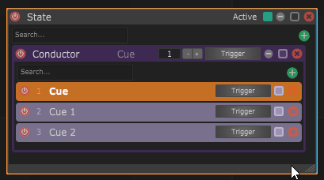
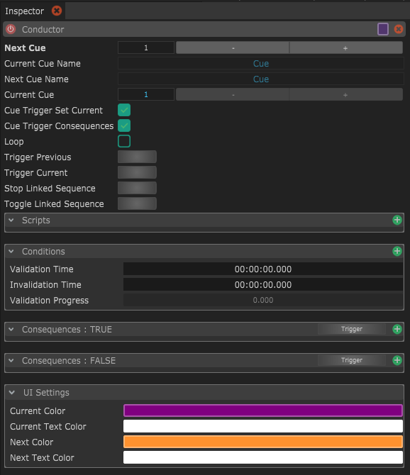
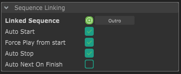

# Conductor

A conductor let's you create a cue list of sequential actions. Each cue can trigger multiple consequences (like actions) or be linked to a sequence. The conductor keeps track of the current cue (purple background color) and the next cue (orange background color). When the conductor is triggered it will trigger the next cue and increment the current and next cues.

<figure><figcaption>
Conductor is triggered and increments the next cue.
</figcaption></figure>

<figure><figcaption>
Conductor inspector parameters.
</figcaption></figure>

## Linking a sequence to a cue

A cue can be linked to a sequence. When this cue is triggered it will automatically play the linked sequence.

<figure><figcaption>
Linking a cue to a sequence.
</figcaption></figure>

With the option "Auto Next On Finish" it will automatically trigger the next cue, when the sequence reaches its end.
