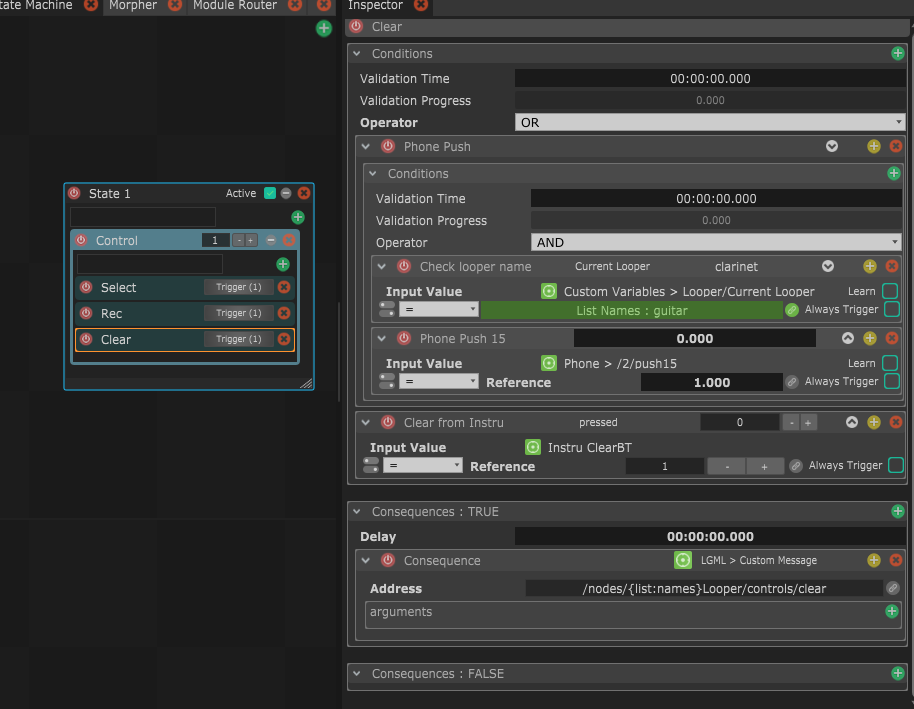

# Multiplex \(1.8\)

Wait, something else than Action and Mapping ?  
Yes ! Well no.. but yes !

Multiplex are a way to work out multiple actions and mappings at once.  
If you've got multiple values that need the same filtering, or same conditions to check, a list of buttons or sliders that you want to process the same way, then you'll find a way to not have to duplicate actions and mappings.

### One to rule them all

Multiplex work with lists : a multiplex has a count parameter that deefines how many iterations it handles. Then you can create as many lists as you want, that will be of the same length as the multiplex's count.

After setting that up, you can add Actions and Mapping into the Multiplex, and they will automatically get new capabilities.

You will be able to use a List as an Input for Conditions, or link a specific parameter in Consequence, Mapping Output or Mapping Filter to a element of the list.

Then all the elements are checked, and when one element of a list is changed, this will trigger the process of the Actions or the Mappings that have this list as an input and process it with knowledge of the index of the source element in its list. The whole process will then keep this information for later use, like linking an element on the same index of another link. This is very practical to have the same process for a lot of items but a specific output for all of them.

### Parameter Linking

A parameter can be linked in different ways :

* In a mapping output, it can link to one of the input values
* In a multiplex, it can link to either the associated index \(0-based or 1-based\) of the source element that triggered the process, or to an element in one of the multiplex's list at the same index as the source element.


For String Parameters, it is possible to use wildcards to create a more complex combination of different linkings :

* {index} will be replaced by the index \(1-based\)
* {index0} will be replaced by the index \(0-based\)
* {input:0} will be replaced by the first value in the mapping input
* {list:names} will be replaced by the element with the same index in list called "Names" \(camelCase conversion\)

This way, something like   
**Hello {list:names}, you're patient number {index}**   
would translate to  
**Hello Leon, you're patient number 5** 


