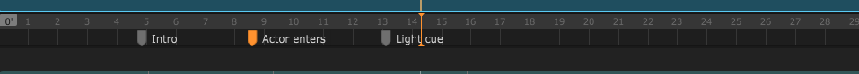

# Interface and navigation

### Cues

Cues are marks that you can add on the timeline, and then use to play from there, or go to the next cue, etc. 


You can also choose to pause the timeline when it hits a cue, which can be convenient when doing semi-interactive shows \(waiting for an actor to finish a line, or a dancer to come on stage before continuing\)


### Zooming and scrolling

By clicking and dragging up/down and left/right the blue rectangle on top of the sequence's timeline, you will be able to navigate and zoom.

