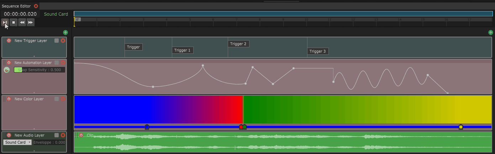

# Introduction to the Time Machine

## The Time Machine

The Time Machine will let you create timeline-based sequences and create triggers and parameter animations over time.

You can create as many sequences as you want from the Sequence panel, and control them independently.

### Sequence

A sequence is time-based object that has its own timeline and contains a group of layers.


**SHORTCUTS AND NAVIGATION**\
**- Drag the blue bar horizontal / vertical :** Zoom in/out and change the time focus frame\
**-  Right click on the blue bar :** Reset the view to a full view of the whole sequence\
**- Ctrl + C, Ctrl + V, Ctrl + D :** Copy, paste, duplicate items (this applies to all items in lists and views, i.e. Sequences, Layers, Triggers...)


### Layer

A layer is one line of a timeline, containing data that is read through time. It can be of multiple types :

* [Triggers](trigger-layer.md)
* [Mapping](../the-state-machine/mappings.md)
* [Mapping 2D](mapping-2d-layer.md)
* [Color](color-layer.md)
* [Audio](audio-layer.md)
