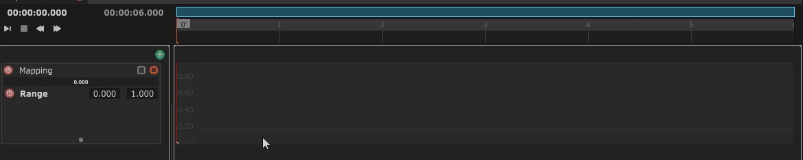

# Mapping Layer

A Mapping layer contains an automation, which is a curve based animation. This is curve is then used as an input for a mapping. You can then use this layer that like a state mapping and add filters and outputs.

The Mapping Layer features some features to ease the creation of animations.

## The Recorder

The recorder allows you to record in time an input value and convert it into a curve. You just have to choose an Input value, activate the **Arm **parameter and start playing. The value of this parameter will then be shown in red in the layer and when stopping the sequence it will convert automatically into an editable curve.

## Painting Automation&#x20;


This feature is only available starting the 1.7.x cycle.


You can draw a curve by holding **Ctrl+Shift **and dragging your mouse from left to right in the timeline of the Mapping layer. Your drawing will then be automatically converted into an editable automation.

## Setting range and timeline navigation&#x20;


This feature is only available starting the 1.7.x cycle.


You can choose the range of your automation from the "**Range**" parameter in the panel. You can also make it free range by disabling this parameter. You will then be able to scroll in the layer by using **Alt ** (and **Alt+Shift **for zooming**)** and dragging the mouse vertically.
